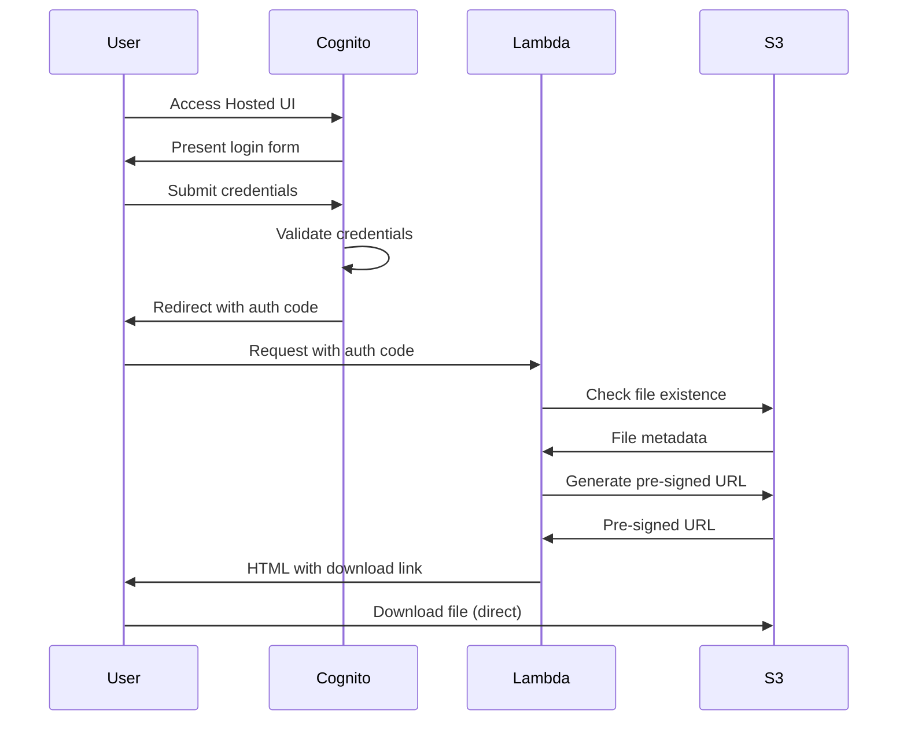
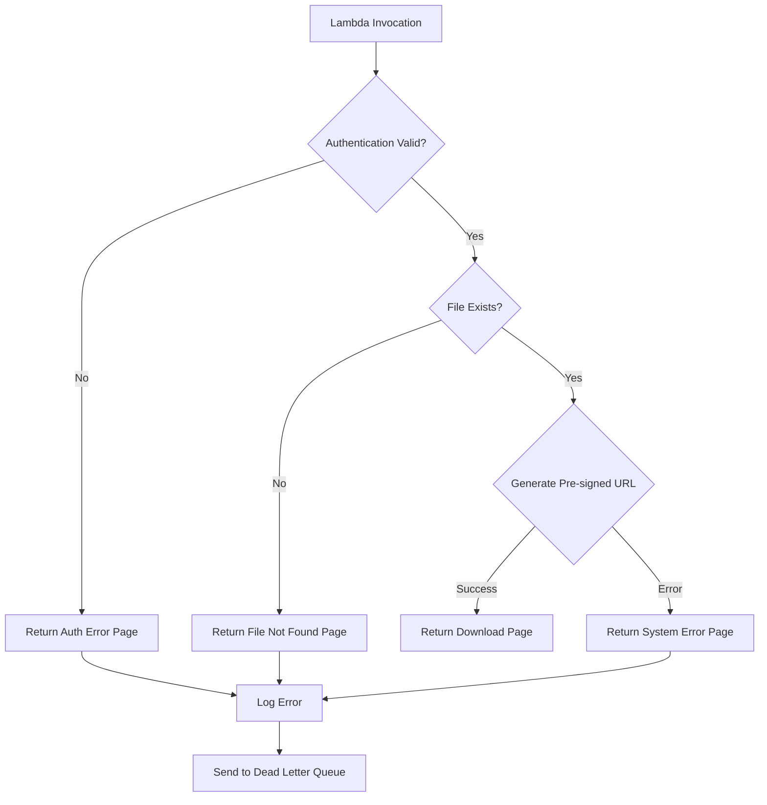
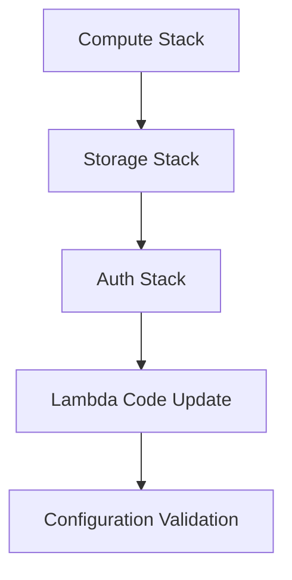

# Architecture Guide - Secure Photo Downloader

This document provides a comprehensive overview of the system architecture, design decisions, and technical implementation details.

## 🏗️ System Overview

The Secure Photo Downloader is a serverless application built on AWS that provides secure, time-limited access to private files through authenticated downloads.

### High-Level Architecture

```
┌─────────────────┐    ┌──────────────────┐    ┌─────────────────┐
│                 │    │                  │    │                 │
│      User       │───▶│   Cognito        │───▶│    Lambda       │
│   (Browser)     │    │  Hosted UI       │    │   Function      │
│                 │    │                  │    │                 │
└─────────────────┘    └──────────────────┘    └─────────────────┘
         │                       │                       │
         │                       │                       │
         ▼                       ▼                       ▼
┌─────────────────┐    ┌──────────────────┐    ┌─────────────────┐
│                 │    │                  │    │                 │
│   File Download │    │   User Pool      │    │   S3 Bucket     │
│  (Pre-signed)   │    │  Identity Pool   │    │ (Private Files) │
│                 │    │                  │    │                 │
└─────────────────┘    └──────────────────┘    └─────────────────┘
```

## 🔧 Component Architecture

### 1. Authentication Layer (AWS Cognito)

#### User Pool
- **Purpose**: Manages user identities and authentication
- **Features**:
  - Email-based authentication
  - Strong password policies
  - Email verification
  - Hosted UI for seamless user experience
  - OAuth 2.0 flows

#### Identity Pool
- **Purpose**: Provides AWS credentials for authenticated users
- **Features**:
  - Federated identity management
  - Temporary AWS credentials
  - Role-based access control

#### Configuration
```yaml
User Pool:
  - Username: Email address
  - Password Policy: 8+ chars, mixed case, numbers, symbols
  - MFA: Optional (configurable)
  - Email Verification: Required
  
Identity Pool:
  - Unauthenticated Access: Disabled
  - Provider: Cognito User Pool
  - Role Mapping: Authenticated users only
```

### 2. Compute Layer (AWS Lambda)

#### Function Specifications
- **Runtime**: Python 3.11
- **Memory**: 256 MB (configurable)
- **Timeout**: 30 seconds (configurable)
- **Concurrency**: 10 reserved (configurable)

#### Function Flow
```python
def lambda_handler(event, context):
    # 1. Parse OAuth callback
    # 2. Validate authentication
    # 3. Check file existence in S3
    # 4. Generate pre-signed URL
    # 5. Return HTML with download link
    # 6. Handle errors gracefully
```

#### Environment Variables
```bash
BUCKET_NAME=secure-photo-downloader-ACCOUNT-REGION-storage
OBJECT_KEY=photos/photos.zip
DOWNLOAD_EXPIRY=3600
APP_NAME=Secure Photo Downloader
ENVIRONMENT=production
LOG_LEVEL=INFO
```

### 3. Storage Layer (AWS S3)

#### Bucket Configuration
- **Access**: Private (no public access)
- **Encryption**: AES-256 server-side encryption
- **Versioning**: Enabled (configurable)
- **Lifecycle**: Intelligent tiering after 30 days

#### Security Policies
```json
{
  "Version": "2012-10-17",
  "Statement": [
    {
      "Sid": "AllowCognitoAuthenticatedUsers",
      "Effect": "Allow",
      "Principal": {
        "AWS": "arn:aws:iam::ACCOUNT:role/cognito-authenticated-role"
      },
      "Action": "s3:GetObject",
      "Resource": "arn:aws:s3:::bucket-name/photos/*",
      "Condition": {
        "Bool": {
          "aws:SecureTransport": "true"
        }
      }
    }
  ]
}
```

### 4. Monitoring Layer (CloudWatch)

#### Logging Strategy
- **Lambda Logs**: Function execution, errors, performance
- **S3 Access Logs**: File access patterns, security events
- **Cognito Logs**: Authentication attempts, user activities

#### Metrics and Alarms
- Lambda error rate monitoring
- S3 access pattern analysis
- Authentication failure tracking
- Cost monitoring and alerts

## 🔐 Security Architecture

### Defense in Depth

#### Layer 1: Network Security
- HTTPS/TLS encryption for all communications
- AWS VPC isolation (if deployed in VPC)
- No direct internet access to storage

#### Layer 2: Identity and Access Management
- AWS Cognito for user authentication
- IAM roles with least privilege principle
- Temporary credentials with limited scope

#### Layer 3: Application Security
- Input validation and sanitization
- Error handling without information disclosure
- Secure session management

#### Layer 4: Data Security
- S3 server-side encryption at rest
- Pre-signed URLs with time expiration
- No permanent public access to files

### Security Controls

#### Authentication Controls
```yaml
Password Policy:
  - Minimum Length: 8 characters
  - Require Uppercase: Yes
  - Require Lowercase: Yes
  - Require Numbers: Yes
  - Require Symbols: Yes
  - Temporary Password Validity: 7 days

Session Management:
  - Access Token Validity: 60 minutes
  - ID Token Validity: 60 minutes
  - Refresh Token Validity: 5 days
```

#### Authorization Controls
```yaml
IAM Role Permissions:
  - S3: GetObject (specific prefix only)
  - S3: ListBucket (specific prefix only)
  - Logs: CreateLogGroup, CreateLogStream, PutLogEvents
  - No administrative permissions
```

#### Data Protection
```yaml
S3 Configuration:
  - Public Access: Blocked
  - Encryption: AES-256
  - Versioning: Enabled
  - MFA Delete: Configurable
  - Access Logging: Enabled
```

## 📊 Data Flow Architecture

### 1. Authentication Flow


### 2. Error Handling Flow


## 🚀 Deployment Architecture

### Infrastructure as Code (CloudFormation)

#### Stack Organization
```
secure-photo-downloader/
├── auth-stack.yaml      # Cognito resources
├── compute-stack.yaml   # Lambda resources  
└── storage-stack.yaml   # S3 resources
```

#### Deployment Dependencies


#### Resource Naming Convention
```
Format: {project-name}-{account-id}-{region}-{resource-type}
Examples:
- secure-photo-downloader-123456789012-us-east-1-storage
- secure-photo-downloader-auth-handler
- secure-photo-downloader-cognito-authenticated-role
```

## 📈 Performance Architecture

### Scalability Considerations

#### Lambda Scaling
- **Concurrent Executions**: 10 reserved (configurable)
- **Cold Start Optimization**: Minimal dependencies
- **Memory Allocation**: 256 MB (optimal for use case)
- **Timeout**: 30 seconds (sufficient for S3 operations)

#### S3 Performance
- **Request Rate**: 3,500 PUT/COPY/POST/DELETE, 5,500 GET/HEAD per prefix
- **Transfer Acceleration**: Available for global users
- **Multipart Upload**: Supported for large files

#### Cognito Limits
- **User Pool**: 40 million users maximum
- **Authentication Rate**: 120 requests per second per user pool
- **Token Refresh**: Configurable validity periods

### Performance Optimization

#### Lambda Optimizations
```python
# Connection reuse
s3_client = boto3.client('s3')  # Outside handler

# Minimal imports
import json
import boto3
import os
from botocore.exceptions import ClientError

# Efficient error handling
try:
    # S3 operations
except ClientError as e:
    # Specific error handling
```

#### S3 Optimizations
```yaml
Lifecycle Rules:
  - Transition to IA: 30 days
  - Transition to Glacier: 90 days
  - Delete incomplete uploads: 7 days

Transfer Optimization:
  - Use appropriate regions
  - Enable transfer acceleration if needed
  - Implement intelligent tiering
```

## 🔄 Disaster Recovery Architecture

### Backup Strategy

#### Data Backup
- **S3 Cross-Region Replication**: Optional for critical files
- **Versioning**: Enabled for accidental deletion protection
- **Point-in-Time Recovery**: Through S3 versioning

#### Configuration Backup
- **CloudFormation Templates**: Version controlled
- **Lambda Code**: Stored in version control
- **Environment Variables**: Documented and backed up

### Recovery Procedures

#### Complete System Recovery
1. Deploy CloudFormation stacks in new region
2. Restore S3 data from backup/replication
3. Update DNS/URLs if necessary
4. Validate functionality

#### Partial Recovery
- **Lambda Issues**: Redeploy function code
- **S3 Issues**: Restore from versioning/backup
- **Cognito Issues**: Recreate user pool (users need re-registration)

## 🔍 Monitoring Architecture

### Observability Stack

#### Metrics Collection
```yaml
Lambda Metrics:
  - Invocations
  - Duration
  - Errors
  - Throttles
  - Dead Letter Queue messages

S3 Metrics:
  - Request count
  - Error rate
  - Data transfer
  - Storage utilization

Cognito Metrics:
  - Authentication attempts
  - Success/failure rates
  - User registrations
```

#### Log Aggregation
```yaml
Log Groups:
  - /aws/lambda/secure-photo-downloader-auth-handler
  - /aws/s3/secure-photo-downloader-access-logs
  - /aws/cognito/secure-photo-downloader

Retention:
  - Lambda: 14 days (configurable)
  - S3 Access: 30 days
  - Cognito: 30 days
```

#### Alerting Strategy
```yaml
Critical Alerts:
  - Lambda error rate > 5%
  - S3 access errors > 10 per hour
  - Authentication failures > 50 per hour

Warning Alerts:
  - Lambda duration > 20 seconds
  - Unusual access patterns
  - Cost thresholds exceeded
```

## 💰 Cost Architecture

### Cost Optimization Strategy

#### Serverless Benefits
- **Pay-per-use**: No idle costs
- **Automatic scaling**: No over-provisioning
- **Managed services**: Reduced operational overhead

#### Cost Breakdown (Estimated)
```yaml
Monthly Costs (1000 downloads):
  - Lambda: $0.20 (invocations + compute)
  - S3: $0.50 (storage + requests)
  - Cognito: $0.55 (active users)
  - CloudWatch: $0.10 (logs + metrics)
  - Total: ~$1.35/month
```

#### Cost Controls
- S3 lifecycle policies for automatic tiering
- CloudWatch log retention policies
- Lambda memory optimization
- Reserved concurrency limits

## 🔧 Customization Architecture

### Extension Points

#### Lambda Function
- Custom authentication logic
- Additional file processing
- Integration with external services
- Custom HTML templates

#### S3 Integration
- Multiple file types support
- Dynamic file selection
- Custom metadata handling
- Integration with other storage services

#### Cognito Configuration
- Custom user attributes
- Social identity providers
- Multi-factor authentication
- Custom authentication flows

### Configuration Management
```yaml
Environment-Specific Settings:
  Development:
    - Shorter token expiry
    - Debug logging enabled
    - Relaxed security policies
    
  Production:
    - Standard security settings
    - Comprehensive monitoring
    - Cost optimization enabled
```

---

This architecture provides a secure, scalable, and cost-effective solution for authenticated file downloads while maintaining high availability and performance.
