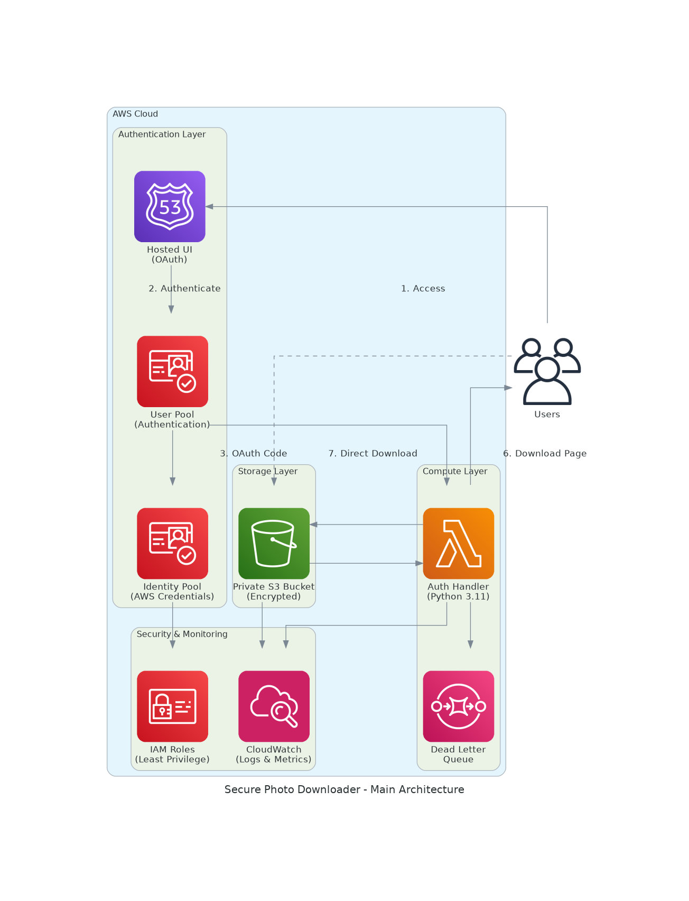
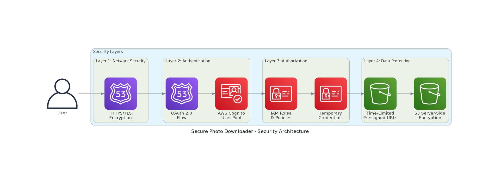
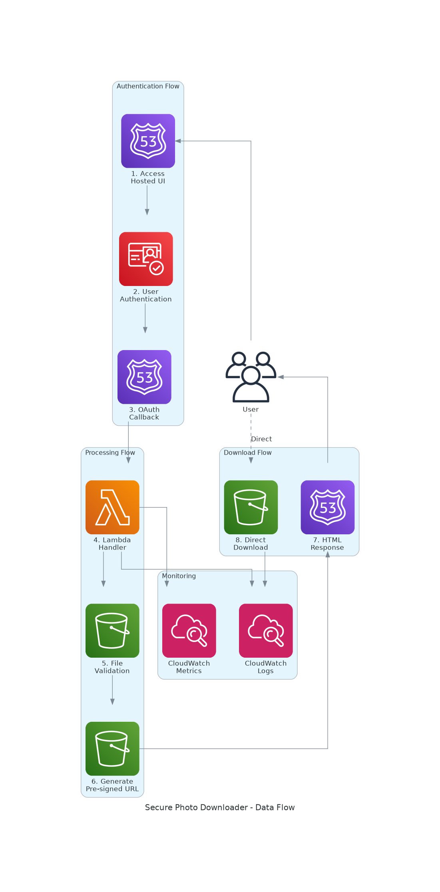
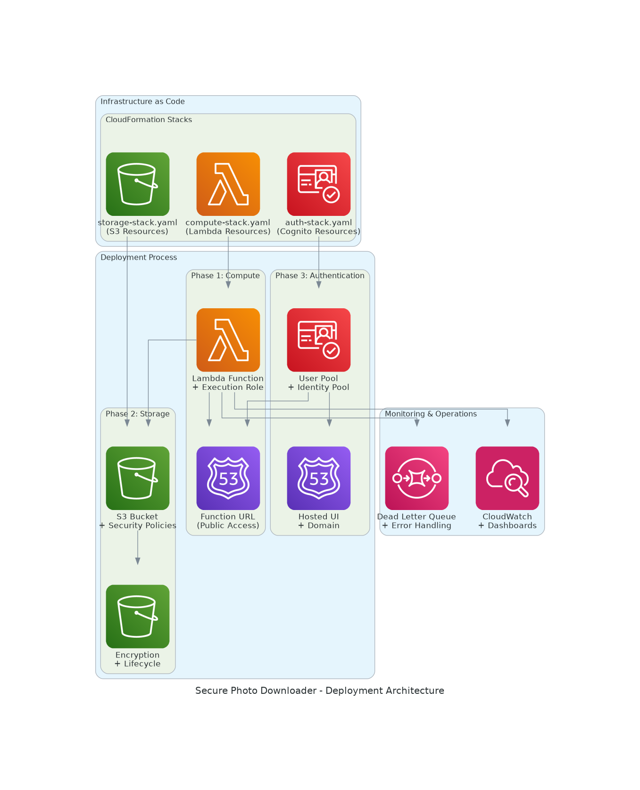
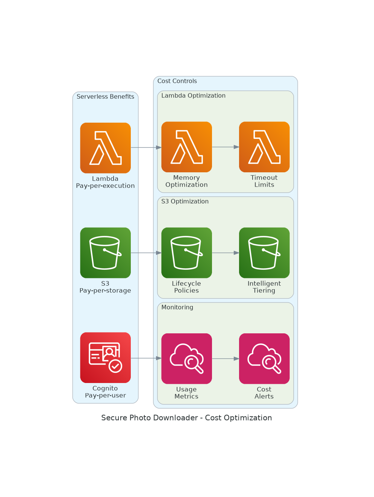

# Architecture Diagrams - Secure Photo Downloader

This document provides detailed explanations of the system architecture diagrams created for the Secure Photo Downloader project.

## 📊 Diagram Overview

All diagrams are generated using Python code with the `diagrams` library, ensuring consistency and maintainability. The diagrams use official AWS icons and follow AWS architecture best practices.

## 🏗️ Main Architecture



### Description
The main architecture diagram shows the complete system overview with all AWS components and their interactions.

### Components
- **Users**: End users accessing the system
- **Authentication Layer**: 
  - Cognito User Pool for user management
  - Identity Pool for AWS credentials
  - Hosted UI for OAuth flows
- **Compute Layer**: 
  - Lambda function for authentication handling
  - Dead Letter Queue for error handling
- **Storage Layer**: 
  - Private S3 bucket with encryption
- **Security & Monitoring**: 
  - IAM roles with least privilege
  - CloudWatch for logs and metrics

### Data Flow
1. User accesses Hosted UI
2. Authentication via Cognito User Pool
3. OAuth code sent to Lambda function
4. Lambda checks file existence in S3
5. S3 returns pre-signed URL to Lambda
6. Lambda returns download page to user
7. User downloads directly from S3

## 🔒 Security Architecture



### Description
This diagram illustrates the multi-layered security approach implemented in the system.

### Security Layers
1. **Network Security**: HTTPS/TLS encryption for all communications
2. **Authentication**: AWS Cognito with OAuth 2.0 flows
3. **Authorization**: IAM roles and temporary credentials
4. **Data Protection**: S3 encryption and time-limited pre-signed URLs

### Security Features
- End-to-end encryption
- Zero-trust architecture
- Principle of least privilege
- Time-limited access tokens
- No permanent credentials

## 🔄 Data Flow



### Description
Detailed step-by-step data flow showing the complete user journey from authentication to file download.

### Process Steps
1. **Access Hosted UI**: User navigates to authentication page
2. **User Authentication**: Credentials verified by Cognito
3. **OAuth Callback**: Authorization code returned to Lambda
4. **Lambda Handler**: Processes authentication and validates request
5. **File Validation**: Checks if requested file exists in S3
6. **Generate Pre-signed URL**: Creates time-limited download link
7. **HTML Response**: Returns download page to user
8. **Direct Download**: User downloads file directly from S3

### Monitoring
- CloudWatch Logs capture all events
- CloudWatch Metrics track performance
- Error handling with detailed logging

## 🚀 Deployment Architecture



### Description
Shows the Infrastructure as Code approach using CloudFormation stacks and deployment phases.

### CloudFormation Stacks
- **auth-stack.yaml**: Cognito User Pool and Identity Pool resources
- **compute-stack.yaml**: Lambda function and execution environment
- **storage-stack.yaml**: S3 bucket with security policies

### Deployment Phases
1. **Phase 1 - Compute**: Deploy Lambda function and execution role
2. **Phase 2 - Storage**: Create S3 bucket with security policies
3. **Phase 3 - Authentication**: Set up Cognito pools and Hosted UI

### Operations
- CloudWatch dashboards for monitoring
- Dead Letter Queue for error handling
- Automated deployment scripts

## 💰 Cost Optimization



### Description
Illustrates the cost optimization strategies implemented in the serverless architecture.

### Serverless Benefits
- **Lambda**: Pay-per-execution model
- **S3**: Pay-per-storage with intelligent tiering
- **Cognito**: Pay-per-active-user pricing

### Cost Controls
- **S3 Optimization**: 
  - Lifecycle policies for automatic tiering
  - Intelligent tiering for cost reduction
- **Lambda Optimization**: 
  - Memory optimization for performance/cost balance
  - Timeout limits to prevent runaway costs
- **Monitoring**: 
  - Cost alerts for budget management
  - Usage metrics for optimization insights

## 🛠️ Diagram Generation

### Prerequisites
```bash
# Install required packages
pip install diagrams
sudo apt install graphviz
```

### Generate Diagrams
```bash
# Run the diagram generation script
python create_diagrams.py
```

### Customization
The diagrams can be customized by modifying the `create_diagrams.py` script:
- Change colors and styling
- Add or remove components
- Modify layout and clustering
- Update labels and descriptions

## 📋 Diagram Files

| Diagram | File | Purpose |
|---------|------|---------|
| Main Architecture | `main_architecture.png` | Overall system overview |
| Security Architecture | `security_architecture.png` | Security layers and controls |
| Data Flow | `data_flow.png` | Step-by-step process flow |
| Deployment Architecture | `deployment_architecture.png` | Infrastructure deployment |
| Cost Optimization | `cost_optimization.png` | Cost management strategies |

## 🔄 Updating Diagrams

When the system architecture changes:

1. **Update the Python script**: Modify `create_diagrams.py`
2. **Regenerate diagrams**: Run the script to create new PNG files
3. **Update documentation**: Revise this document if needed
4. **Commit changes**: Add updated diagrams to version control

## 📚 Additional Resources

- [AWS Architecture Icons](https://aws.amazon.com/architecture/icons/)
- [Diagrams Library Documentation](https://diagrams.mingrammer.com/)
- [AWS Well-Architected Framework](https://aws.amazon.com/architecture/well-architected/)
- [AWS Security Best Practices](https://aws.amazon.com/security/security-resources/)

---

These diagrams provide a visual representation of the Secure Photo Downloader architecture, making it easier to understand the system design, security model, and deployment strategy.
